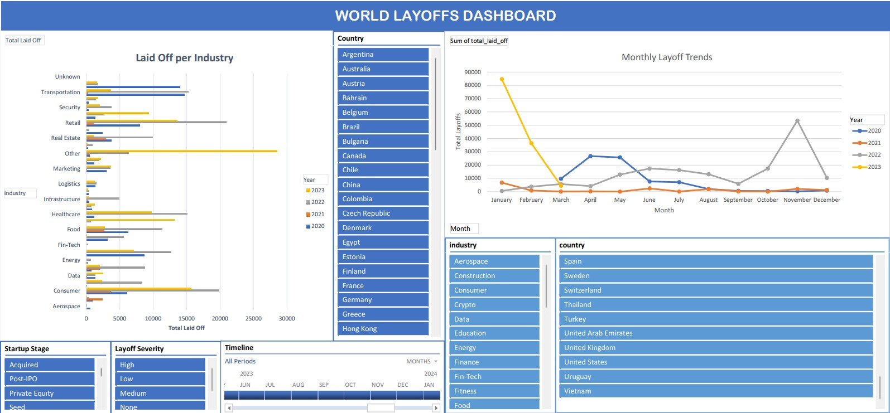

# Layoffs Data Cleaning & Visualization Project

## 📌 Project Overview

This project is part of Alex The Analyst's Data Analyst BootCamp, focusing on cleaning, preparing, and visualizing a dataset of company layoffs. The raw data includes records of layoffs across various industries, locations, and startup stages. The final output features interactive Excel dashboards for deeper insights.

## 🗂 Dataset

- Source: [Layoffs Dataset](https://github.com/AlexTheAnalyst/MySQL-YouTube-Series/blob/main/layoffs.csv)

- Raw Data Issues: Inconsistencies, null values, and duplicate rows.

- Cleaned Data Improvements:

  - Removed duplicates

  - Standardized fields (e.g., dates, industries)

  - Handled missing values (NULL → 0)

  - Added new filter columns: Layoff Severity, Month, and Year

  - Saved cleaned data in layoffs_cleaned.csv

## 🛠 Tools Used

- MySQL – Data cleaning and querying

- MySQL Workbench – SQL IDE

- Excel – Data visualization with Pivot Tables & Dashboards

- GitHub – Version control and project sharing

## 🔍 Data Cleaning Process

1. Create Schema: `world_layoffs`

2. Load Dataset: Import `layoffs.csv`

3. Run Cleaning Queries: Execute `layoffs_cleaning.sql`

4. Export Cleaned Data: Save as `layoffs_cleaned.csv`

## 📊 Exploratory Data Analysis (EDA)

### Objective

To uncover trends, patterns, and insights in the layoffs dataset by analyzing industry distributions, time-based trends, and variable relationships.

### EDA Steps

Dataset Overview – Checked summary statistics & data distribution.

Trends Over Time – Analyzed layoffs by month and quarter.

Industry & Country Analysis – Identified top affected sectors and regions.

Correlation Analysis – Examined relationships between total layoffs, company stage, and funding.

Anomaly Detection – Flagged outliers and uncommon records.

### Key Findings

- 📌 Tech, Crypto, and Retail saw the highest layoffs.
- 📌 Layoffs peaked in November 2022 and early 2023.
- 📌 The United States was the most affected country.
- 📌 Post-IPO startups had the highest layoff numbers.
- 📌 Some outliers suggest further investigation is needed.

## 📈 Excel Data Visualization

This project includes an Excel-based interactive dashboard to visualize layoffs across different industries, countries, and time periods.

### Key Visualizations

1. Layoffs by Industry – Shows total layoffs per industry over time.

2. Monthly Layoff Trends – Displays layoffs per month from 2020 to 2023.

### How to Use the Dashboard

1. Download `layoffs_excel_visualization.xlsx`

2. Open in Microsoft Excel or Google Sheets

3. Explore the interactive Pivot Table & Dashboard

Preview 📷

## 🚀 Future Improvements

1. Geographic Heatmap – Visualize layoffs by country.

## 🎓 Learn Together

I followed Alex The Analyst's free BootCamp on [YouTube](https://www.youtube.com/playlist?list=PLUaB-1hjhk8FE_XZ87vPPSfHqb6OcM0cF) and if you are interested to be Data Analyst, you should [follow](https://www.youtube.com/playlist?list=PLUaB-1hjhk8FE_XZ87vPPSfHqb6OcM0cF) him too, to learn more about Data Analysis.

## 📜 License

This project is open-source. Feel free to use and modify it!

